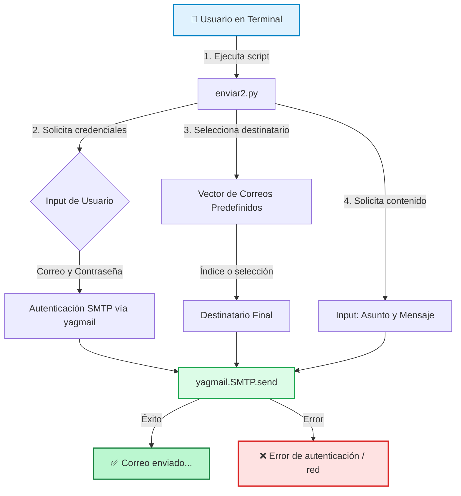

# 📧 Mail Python - Automatización de Correos CLI

> **Herramienta de línea de comandos para el envío automatizado de correos electrónicos** mediante SMTP (Gmail). Diseñada para ejecutarse desde terminales Linux o Android (Termux), permitiendo enviar mensajes a una base de datos preconfigurada de direcciones de atención al cliente y soporte técnico.

Un script ligero escrito en **Python 3** que simplifica el proceso de envío de correos mediante la librería `yagmail`, eliminando la fricción de las interfaces gráficas y permitiendo la automatización mediante bucles, funciones y vectores.

Proyecto archivado por cambio de libreria y flujo

---

## 🚀 Características Principales

- ⚡ **Ejecución desde Terminal**: Interfaz CLI interactiva, ideal para entornos sin GUI (servidores, Termux, Raspberry Pi).
- 📱 **Multiplataforma**: Soporte nativo mediante scripts de instalación para **GNU/Linux** (Debian/Ubuntu) y **Android** (Termux).
- 🗂️ **Base de Datos Preconfigurada**: Incluye un vector con direcciones de correo de soporte y atención al cliente de diversas empresas y servicios.
- 🔄 **Código Refactorizado**: Evolución de un script lineal a una versión modular (`enviar2.py`) implementando buenas prácticas:
  - Uso de **vectores (listas)** para gestión de destinatarios.
  - **Funciones** para separar responsabilidades.
  - **Ciclos (bucles)** para envíos múltiples o iterativos.
- 🎨 **Interfaz con Colores ANSI**: Salida formateada en terminal para mejorar la legibilidad de los estados (éxito, error, información).
- 📎 **Soporte para Adjuntos**: Capacidad nativa (comentada en el código) para adjuntar imágenes o documentos vía `yagmail.inline()`.

---

## 🏗️ Arquitectura y Flujo de Ejecución



---

## 📂 Estructura del Proyecto

```text
mail_python/
├── enviar.py          # 📜 Versión original (script lineal)
├── enviar2.py         # 🚀 Versión mejorada (vectores, funciones, ciclos)
├── Install.sh         # 🛠️ Script de instalación automática de dependencias
├── README.md          # 📖 Este archivo
└── LICENSE            # Licencia GNU (heredada de la librería base)
```

---

## 📋 Requisitos Previos

- **Python 3.x** instalado en el sistema.
- **Git** para clonar el repositorio.
- **Cuenta de Google (Gmail)** con configuración de seguridad ajustada (ver sección de Configuración).
- Conexión a Internet activa.

---

## 🛠️ Instalación

### 1. Clonar el repositorio
```bash
apt install python3 git -y  # En Termux usa 'pkg install'
git clone https://github.com/MartinCiro/mail-python.git
cd mail-python/
```

### 2. Ejecutar el instalador automático
El script `Install.sh` detecta automáticamente el sistema operativo e instala las dependencias necesarias (`yagmail`, `lxml`, `cython`, etc.):

```bash
chmod 777 Install.sh
bash Install.sh
```

**Comportamiento del instalador:**
- **En GNU/Linux**: Ejecuta `sudo apt install python3 python3-pip` y configura permisos.
- **En Android (Termux)**: Ejecuta `pkg install libtool binutils clang libxml2 libxslt python python3 git` y usa `pip` para instalar `yagmail`.

---

## ⚙️ Configuración de Seguridad en Google (Crucial)

Para que el script pueda autenticarse en los servidores SMTP de Google, **debes** configurar tu cuenta para permitir el acceso:

### Opción A: Contraseñas de Aplicación (Recomendada y más segura)
1. Activa la **Verificación en dos pasos (2FA)** en tu cuenta de Google.
2. Ve a [Contraseñas de aplicaciones](https://myaccount.google.com/apppasswords).
3. Genera una contraseña específica para este script.
4. Usa esa contraseña de 16 caracteres cuando el script te pida tu "contraseña" (no uses tu contraseña normal de Gmail).

### Opción B: Aplicaciones menos seguras (Deprecada por Google)
> ⚠️ *Nota: Google ha deshabilitado esta opción en la mayoría de las cuentas desde 2022. Si tu cuenta es antigua o corporativa, podrías intentar habilitarla aquí:*
> [Permitir el acceso de aplicaciones menos seguras](https://myaccount.google.com/lesssecureapps)

**Modifica el script:**
Abre `enviar2.py` con tu editor favorito y reemplaza las variables de autenticación con tu correo y la contraseña generada:
```python
correo = "tu_correo@gmail.com"
contraseña = "tu_contraseña_de_aplicacion"
```

---

## 🎮 Uso

Ejecuta la versión mejorada del script:

```bash
python3 enviar2.py
```

El programa te guiará interactivamente:
1. Te pedirá el número de teléfono o identificador (usado como referencia).
2. Te mostrará un menú con la lista de correos preconfigurados (soporte de diversas empresas).
3. Te solicitará el **Asunto** y el **Cuerpo del mensaje**.
4. Enviará el correo y mostrará el estado en pantalla con códigos de color ANSI.

---

## 🔄 Evolución del Código (Refactorización)

El proyecto demuestra la capacidad de mejorar código heredado mediante la transición de `enviar.py` a `enviar2.py`:

| Característica | `enviar.py` (Original) | `enviar2.py` (Refactorizado) |
| :--- | :--- | :--- |
| **Estructura** | Lineal, todo en el flujo principal | Modular, uso de funciones |
| **Destinatarios** | Condicionales `if/elif` anidados | Vectores (Listas) e iteración |
| **Mantenibilidad** | Baja (código repetitivo) | Alta (fácil de escalar) |
| **Reutilización** | Nula | Posibilidad de importar funciones |

---

## ⚠️ Descargo de Responsabilidad

> **Aviso Legal y de Uso Responsable**
> 
> Este proyecto ha sido desarrollado con **fines exclusivos de automatización y aprendizaje**. 
> - No se nombra ni ataca a ninguna empresa en particular; los correos incluidos son direcciones públicas de atención al cliente y soporte técnico.
> - El autor (**Martin Ciro**) **no se hace responsable** del uso indebido, malintencionado o ilegal (como spam masivo o acoso) que terceros puedan darle a esta herramienta.
> - El usuario final es el único responsable de cumplir con las leyes de protección de datos y normativas anti-spam (CAN-SPAM, GDPR, etc.) de su jurisdicción.

---

## 🤝 Créditos y Agradecimientos

- **Idea Original**: Basado en el script publicado por [AnonyVox](https://github.com/AnonyVox).
- **Librería Core**: [yagmail](https://github.com/kootenpv/yagmail) - Yet Another Gmail/SMTP client for Python.
- **Refactorización y Adaptación**: Martin Ciro (Soporte para Termux, menús interactivos, vectores).

---

## 👤 Autor

**Martin Ciro**  
[](https://github.com/MartinCiro)

---
*Desarrollado con Python 3 y yagmail. Una herramienta CLI para automatización de comunicaciones.*